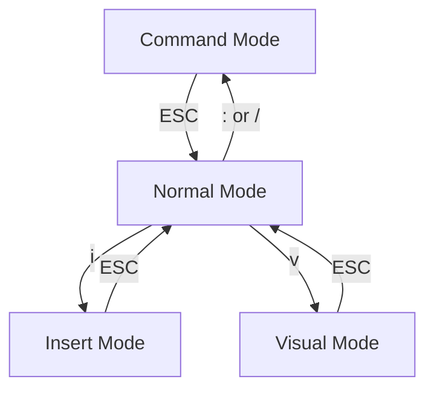

# Vimを使ってみよう
君も今日からvimmerになれる

<!--
The last comment block of each slide will be treated as slide notes. It will be visible and editable in Presenter Mode along with the slide. [Read more in the docs](https://sli.dev/guide/syntax.html#notes)
-->

---
layout: table-contents
---
# Contents
1. なぜVimなのか
2. テキストエディタとしてのvim
3. Vimを触ってみる
4. Vimの4つのモード
5. Vimでのファイル操作
6. Vimでカーソル移動する
7. Vimの将来
---
layout: two-cols
---

<template v-slot:default>

# なぜVimなのか


- **1991年に誕生したCLIテキストエディタ**: 
  - 根強い人気
  - IDEではない
- **爆速コーディング**:
  - マウス無しの豊富なキーバインド
  - 3種類のモード
- **豊かなカスタマイズ性**: 
  - 豊富なプラグイン
  - 設定をいじるだけで一日が溶ける

</template>
<template v-slot:right>

<!--  -->


</template>

---
layout: cover
---
# テキストエディタとしてのvim
## CLI (Command Line Interface) テキストエディタ
- Vscode, Jetbrains IDE群はGUI (Graphical User Interface) のエディタ
- CLIだとEmacs, nano, hilix (最近でたやつ)がある
## マウスの概念が存在しない
- マウス無しでテキストの**編集**、**選択**、**カーソル移動**
- マウスを触らない -> キーボードしか触らない -> 爆速コーディング
## 最小限の機能、豊富なカスタマイズ性
- デフォルトでは最小限の機能しかない
  - .vimrcファイルで設定管理
	```vim
	set number " 行番号が表示される
	set syntax " シンタックスハイライト
	```
- 豊富なプラグイン

---
layout:cover
---
# Vimを触ってみる

## 起動する
- ターミナルを開く
- vimと入力
- vim起動完了

## 終了する
- :qと入力する (quit)

<br />

<div class='text-center'>

# Vimは怖くない

</div>


---
layout: two-cols
---

<template v-slot:default>

# Vimの4つのモード
## Normal Mode
**ESC入力**

## Insert Mode (編集)
**Normal modeでi入力**

## Visual Mode (選択)
**Normal modeでv入力**

## Command Mode (コマンド実行)
**Normal modeで:, /入力**

</template>
<template v-slot:right>


<div class="text-center">



</div>

</template>

---
layout: cover
---
# Vimでのファイル操作

基本的にCommand modeで行なう
## ファイルを開く
**:e** edit

## ファイルを保存する
**:w** write

## Vimを閉じる
**:q** quit

---
layout: cover
---
# Vimでカーソル移動する
基本的にNormal modeで行なう
## 基本
- **h, j, k, l**: 右, 下, 上, 左

## 画面移動
- **Ctrl + d**: 0.5画面下移動 (down)
- **Ctrl + u**: 0.5画面上移動 (up)
- **Ctrl + f**: 1画面下移動 (forward)
- **Ctrl + b**: 1画面上移動 (backward)

---
layout: cover
---
# Vimでカーソル移動する
基本的にNormal modeで行なう

## 行内移動
- **0**: 行頭に移動
- **$**: 行末に移動

## ファイル先頭、末尾
- **gg**: 先頭に移動
- **G**: 末尾に移動
---
layout: two-cols
---

<template v-slot:default>

# Vimの将来
## Vimの課題
- メンテナーが1人しかいない
- VimScriptで実装されている
  - 実装のために新しい言語を覚える必要がある

## Neovimの登場
- API実装
- Neovim v0.5.0からLua実装

</template>
<template v-slot:right>

<br />
<br />
<br />
<br />
<br />


</template>
<!--
You can have `style` tag in markdown to override the style for the current page.
Learn more: https://sli.dev/guide/syntax#embedded-styles
-->
---

---
